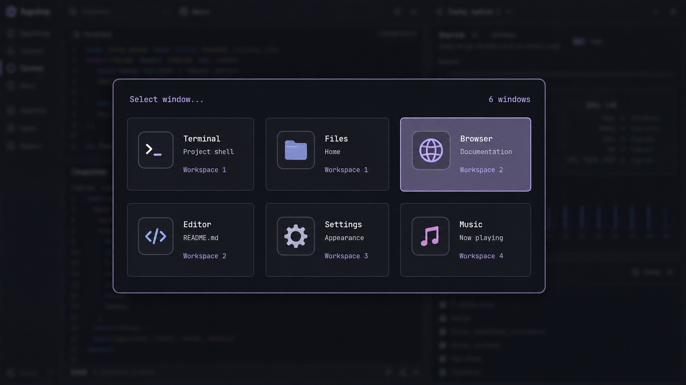

# Windows-style Alt-Tab for Omarchy

A fast, theme-aware overview of every open window, inspired by the familiar
Windows Alt-Tab switcher and built directly for the Omarchy Quattro shell.



## Features

- Shows windows from all regular workspaces in a responsive grid.
- Selects the next window on the first `Alt+Tab` press.
- Cycles while Alt is held and activates on Alt release.
- Supports arrow keys, `Shift+Tab`, Enter, Space, Escape, and the mouse.
- Uses Omarchy's current popup and menu colors automatically.
- Resolves icons through the desktop entry database and bundled local web-app
  icons without making network requests.

## Requirements

- Omarchy 4 (Quattro) or newer
- `omarchy-shell` running on Hyprland

## Install

```sh
omarchy plugin add https://github.com/leandro-3rne/omarchy-window-switcher.git --enable
```

Add the following to `~/.config/hypr/bindings.lua`:

```lua
-- Replace Omarchy's default Alt-Tab bindings with the overview.
hl.unbind("ALT + TAB")
hl.unbind("ALT + SHIFT + TAB")

o.bind(
    "ALT + TAB",
    "Window overview",
    "omarchy-shell shell call io.github.leandro-3rne.window-switcher cycle next"
)

o.bind(
    "ALT + SHIFT + TAB",
    "Window overview (previous)",
    "omarchy-shell shell call io.github.leandro-3rne.window-switcher cycle previous"
)
```

Hyprland reloads the file automatically. Check the result with:

```sh
hyprctl configerrors
```

## Usage

- Hold Alt and tap Tab to move forward.
- Hold Alt and press Shift+Tab to move backward.
- Release Alt, or press Enter/Space, to activate the selected window.
- Use the arrow keys or mouse when the overview is open.
- Press Escape or click the dimmed background to cancel.

You can also summon it directly:

```sh
omarchy-shell shell summon io.github.leandro-3rne.window-switcher '{}'
```

## Web-app icons and network safety

Chromium web apps do not always expose a desktop icon that matches their
window class. Known apps use bundled local icons or installed icon-theme
entries; unknown apps fall back to their desktop entry icon.

The switcher never derives a URL from a client's app ID and never performs
network requests. This keeps forged Wayland client metadata from turning the
long-running shell into an HTTP client.

## Remove

Remove the two custom bindings from `~/.config/hypr/bindings.lua`, restore any
Alt-Tab bindings you want to keep, then run:

```sh
omarchy plugin remove io.github.leandro-3rne.window-switcher
```

The plugin does not install services, write caches, or modify Hyprland on its
own.

## License

MIT — see [LICENSE](LICENSE).
